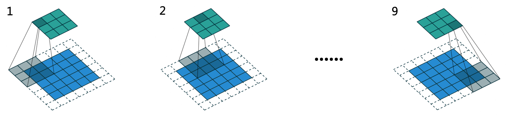

## 卷积神经网络

### 深度卷积神经网络

**感受野（Receptive Field）**，指的是神经网络中神经元「看到的」输入区域，在卷积神经网络中，feature map 上某个元素的计算受输入图像上某个区域的影响，这个区域即该元素的感受野。感受野是个相对概念，某层 feature map 上的元素看到前面不同层上的区域范围是不同的，通常在不特殊指定的情况下，感受野指的是**看到输入图像上的区域**。

例如两个级联的卷积核大小为 $3\times 3$，stride = 2 的卷积层的感受野为 $7\times 7$，如图所示

### 卷积详解

#### 卷积

#### 因果卷积（Causal Convolution）

#### 空洞卷积

空洞卷积具有更大的感受野，有助于构建**长期记忆**功能。

## CNN 历史

#### 从 LeNet-5 到 ResNet

**LeNet-5**

**AlexNet** 首次亮相是在 2012 年的 ILSVRC 大规模视觉识别竞赛上，它的主要成果是将图像分类任务的 Top-5 错误率降低到 15.3%。AlexNet 主要的网络结构是堆砌的卷积层和池化层，最后在网络末端加上全连接层和 Softmax 层来处理多分类任务。AlexNet 的改进：

- 采用**修正线性单元（Rectified Linear Unit，ReLU）**作为激活函数（在此之前常用 Sigmoid 函数），**缓解了深层网络训练时的梯度消失问题。**
- 引入**局部响应归一化（Local Response Normalization，LRN）**模块。
- 应用 **Dropout** 和**数据扩充（data augmentation）**技术来提升训练效果。
- 用分组卷积来突破当时 GPU 的显存瓶颈。

AlexNet 输入的图片大小为 $227\times 227$，每个批次只有 1 张图片。

**VGGNet** 出现在2014 年的 ILSVRC 上，单个模型就将图像分类任务的 Top-5 错误率降低到 8.0%；如果采用多模型集成（ensemble），则可以将错误率进一步降至 6.8%。VGGNet 的改进：

VGGNet-16 输入的图片为 $224\times 224$，每个批次有 10 张图片。

**ResNet** 的提出是为了解决网络**退化（degeneration）**的问题。退化是指随着网络层数的加深，网络的训练误差和测试误差都会上升。而过拟合是训练误差降低而测试误差反而升高的现象。ResNet-152 模型在 ImageNet 2012 数据集的图像分类任务上，单模型使得 Top-5 错误率降至 4.49%，采用多模型集成可以进一步将错误率降低到 3.57%。ResNet 的改进：

- 增加了**跳跃连接（shortcut connection）**，在网络中构筑多条「近道」：
  - 缩短误差反向传播到各层的路径，**有效抑制梯度消失的现象**，使得网络在不断加深时性能不会下降。
  - 若网络在层数加深时性能退化，则它可以通过控制网络中「近道」和「非近道」的组合比例来退回到浅层时的状态，即「近道」具备自我关闭的能力。

