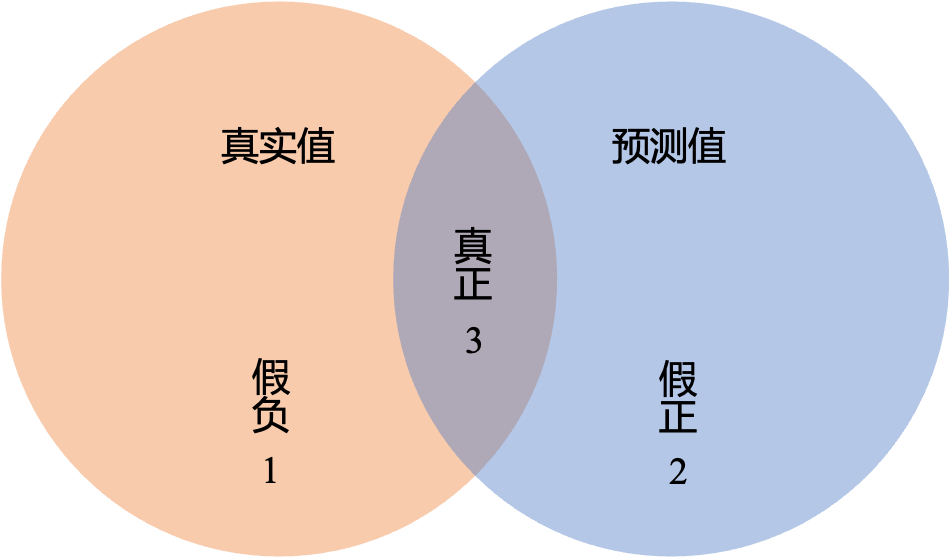
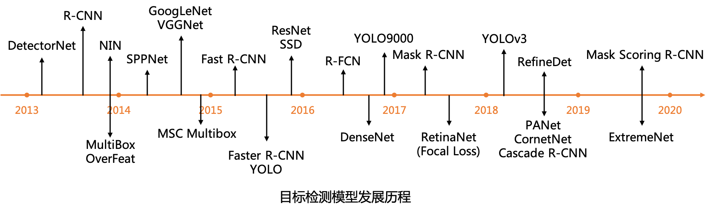
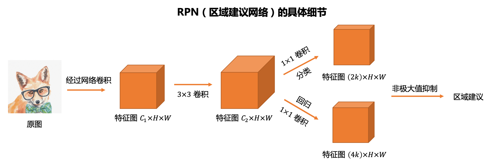
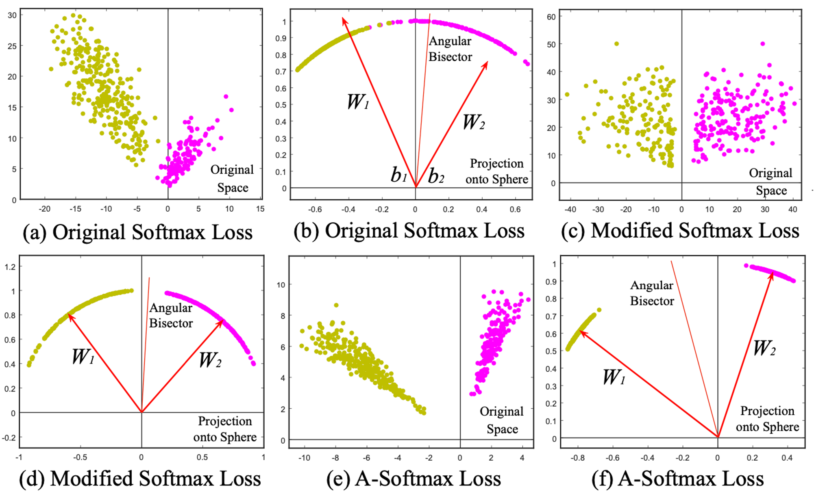

计算机视觉的任务有：图像分类、物体检测、语义分割、文字识别、人脸识别等

CV Baseline 数据：https://deepshare.feishu.cn/docx/doxcnDDF7Kmz7pGjfE7IY2Noppf

## 目标检测

目标检测学习路径：

理论：要求能够复现经典论文的代码

- 图像分类：VGG、Inception、ResNet、MobileNet、SENet
- 图像分割：UNet、DeepLab 系列、FCN、SegNet、BiSeNet
- 目标检测：YOLOv3、Faster R-CNN
- GAN：GAN、DCGAN、Pix2Pix

实践：

- 数据增强技巧：MixUp、Label Smoothing
- 长尾分布（Long-Tail）、渐进式采样（PB-sampling, Progressively-balanced Sampling）
- 数据爬取与筛选：常规筛选方法（经典图像处理和分析方法）、高阶筛选方法（model-base，基于内容的筛选）
- 语义分割：
  - 自动驾驶语义分割：CamVid 数据集，训练 UNet、SegNet；deeplabv3+ 进行模型评估和推理
  - 人像分割：Portrait 数据集；训练 BiseNet；Dice-Loss、CE Dice Loss、Focal Loss
  - 数据增强工具：Albumentations
- 目标检测：
  - YOLOX：Neck、Head、正负样本分配方式
  - COCO 数据集：Mosaic、Mixup、Affine 变化等数据增强方法
  - 轻量级目标检测器：NanoDetPlus
  - 算法终端部署：OpenVINO

### 基础概念

**计算特征图大小**：计算经过卷积、池化等操作之后的特征图大小，这是一个十分常见的考题。假设特征图的输入尺寸为 $l_i$，Padding 大小为 $p$，卷积核或者池化核大小为 $k$，步长为 $s$，那么特征图的输出尺寸 $l_o$ 计算公式为：

$l_o=\lfloor\frac{l_i+2p-k}{s}\rfloor+1,$

其中 $\lfloor\cdot\rfloor$ 代表向下取整。很多深度学习框架会采取向下取整的方式，放弃输入特征图的一部分边界数据。


**计算感受野**：假设网络的原始输入特征图的尺寸为 $L$，第 i 层卷积核（池化核）尺寸 $k_i$，第 j 层的步长为 $s_j$，则第 i 层的感受野大小 $R_i$ 计算如下

$R_i=\min\left( R_{i-1} + (k_i-1)\prod_{j=0}^{i-1}s_j, L \right)$

其中对于原始输入层 $R_0=1, s_0=1$. 


**目标检测（Object Detection）**是计算机视觉中极为重要的基础问题，是实例分割（Instance Segmentation)、场景理解（Secne Understanding）、目标跟踪（Object Tracking）、图像标注（Image Captioning）等问题的基础。

**目标检测任务：**给定一张图片，将图片中的每个物体识别出来并且提出一个置信度，用矩形方框（Bounding Box）或者不规则的区域标识出来。

目标检测模型分为单步（one-stage）模型和两步（two-stage）模型两大类。单步模型在计算效率上有优势，两步模型在检测精度上有优势。

**单步模型**是指没有独立地、显式地提取候选区域（region proposal），直接由输入图像得到其中存在的物体的类别和位置信息的模型。例如 OverFeat、SSD（Single Shot multibox-Detector）、YOLO（You Only Look Once） 等模型。

**两步模型**是指有独立的、显式的候选区域提取过程，即先在输入图像上筛选出一些可能存在物体的候选区域，然后针对每个候选区域，判断其是否存在物体，如果存在就给出物体的类别和位置修正信息。例如 R-CNN、SPPNet、Fast R-CNN、Faster R-CNN、R-FCN、Mask R-CNN 等模型。

**交并比（Intersection-over-Union，IoU）**：即两个 Bounding Boxes 之间交集与并集的比值。对于预测 Bounding Box 与 Ground-truth Box 来说，比值越大代表预测的 Bounding Box 结果越好。

可以学习一下 IoU 的 Python 代码 [IoU_demo.py](https://github.com/humengdoudou/object_detection_mAP/blob/master/IoU_demo.py)。

```python
# 这六行短短的代码可以囊括所有 pred bbox 和 gt bbox 之间的关系。包括相交、不相交、各种相交形式等等
ixmin = max(pred_bbox[0], gt_bbox[0])
iymin = max(pred_bbox[1], gt_bbox[1])
ixmax = min(pred_bbox[2], gt_bbox[2])
iymax = min(pred_bbox[3], gt_bbox[3])
iw = np.maximum(ixmax - ixmin + 1., 0.)
ih = np.maximum(iymax - iymin + 1., 0.)

inters = iw * ih  # 交集
uni = ((pred_bbox[2] - pred_bbox[0] + 1.) * (pred_bbox[3] - pred_bbox[1] + 1.) +
           (gt_bbox[2] - gt_bbox[0] + 1.) * (gt_bbox[3] - gt_bbox[1] + 1.) -
           inters)  # 并集 union = S1 + S2 - inters

overlaps = inters / uni  # IoU
```

**均交并比（Mean Intersection over Union, MIoU）**：MIoU 是语义分割的标准度量，其计算两个集合的交集和并集之比。

$\text{MIoU}=\frac{1}{k+1}\sum^{k}_{i=0}{\frac{p_{ii}}{\sum_{j=0}^{k}{p_{ij}+\sum_{j=0}^{k}{p_{ji}-p_{ii}}}}}$

其中 $p_{ij}$ 表示真实值为 $i$，被预测为 $j$ 的数量。



橙色是真实值，蓝色是预测值，中间是两个部分的相交部分。

**均像素精度（Mean Pixel Accuracy, MPA）**：预测正确的部分占整个真实值的比例，或者说真正例占假负例的比例，即面积 3 和面积 1 的比例。

而 MIoU 就是两个部分交集部分与并集部分的比，越接近 1 证明预测结果越好，最理想的情况是 1. 

**非极大值抑制（Non-Maximum Suppression，NMS）**：目标检测过程中在同一个目标的位置上会产生大量的候选框，这些候选框之间可能会有重叠，NMS 的作用就是消除冗余的边界框，找到最佳的目标边界框。NMS 的流程如下：

- 步骤 1. 根据置信度得分进行排序；
- 步骤 2. 选择置信度最高的边界框添加到最终输出列表中，将其从边界框列表中删除；
- 步骤 3. 计算所有边界框的面积；
- 步骤 4. 计算置信度最高的边界框与其他候选框的 IoU；
- 步骤 5. 删除 IoU 大于给定阈值的边界框；
- 步骤 6. 重复上述过程，直到边界框列表为空；

NMS 中的阈值给得越大，则越有可能出现同一个物体有多个边界框的情况。步骤 4 中如果置信度最高的边界框与其他候选框的 IoU 比较大的话，就可以认为这两个边界框中是同一个物体，因此只要留下最大的那一个，把其他的删除了。

代码：

```python
out = net(x)  # forward pass, 将图像 x 输入网络，得到 pred cls + reg
boxes, scores = detector.forward(out, priors)  # 结合 priors，将 pred reg（即预测的 offsets）解码成最终的 pred bbox
boxes = boxes[0]
scores = scores[0]

# scale each detection back up to the image
boxes *= sca;e  # (0, 1) 区间坐标的 bbox 做尺度反正则化
boxes = boxes.cpu().numpy()
scores = scores.cpu().numpy()

for	j in range(1, num_classes):  # 对每一个类 j 的 pred bbox 单独做 NMS
    # 因为第 0 类是 background，不用做 NMS，因此 index 从 1 开始
    inds = np.where(scores[:, j] > thresh)[0]  # 找到该类 j 下，所有 cls score 大于 thresh 的 bbox
    # score 小于阈值的 bbox 直接过滤掉，不用进行 NMS
    if len(inds) == 0:  # 没有满足条件的 bbox，返回空，跳过
        all_boxes[j][i] = np.empty([0, 5], dtype=np.float32)
        continue
    c_bboxes = boxes[inds]
    c_scores = scores[inds, j]  # 找到对应类 j 下的 score 即可
    c_dets = np.hstack((c_bboxes, c_scores[:, np.newaxis])).astype(np.float32, copy=False)  # 将满足条件的 bbox + cls score 的 bbox 通过 hstack 完成合体
    
    keep = nms(c_dets, 0.45, force_cpu=args.cpu)  # NMS，返回需要保存的 bbox index: keep
    c_dets = c_dets[keep, :]
    all_boxes[j][i] = c_dets  # i 对应每张图片，j 对应图像中类别 j 的 bbox 清单
```


**True Positive (TP)**：$\text{IoU} > 0.5$ 的检测框数量（同一个 Ground Truth 只计算一次）

**False Positive (FP)**：$\text{IoU}\le 0.5$ 的检测框（检测到同一个 Ground Truth 的多余检测框的数量

**False Negative (FN)**：没有检测到的 Ground Truth 的数量

**True Negative (TN)**：在 mAP 评价指标中不会使用到

**查准率（Precision）**：

$\text{Precision} = \frac{\text{TP}}{(\text{TP} + \text{FP})} = \frac{\text{FP}}{\text{all detections}}$

**查全率、查全率（Recall）**：

$\text{Recall} = \frac{\text{TP}}{(\text{TP}+\text{FN})}=\frac{\text{TP}}{\text{all ground truths}}$


**PR 曲线（Precision-Recall Curve）**：

**平均精确度（Average Precision）**：PR 曲线下面积

**mAP（mean Average Precison）**：各类别 AP 的平均值。在 VOC2010 以前（VOC07），只要选择当 $\text{Recall}\ge 0, 0.1, 0.2, \dots, 1$ 共 11 个点时的 Precision 最大值，然后 AP 就是这 11 个 Precision 的平均值；在 VOC2010 开始，需要针对每一个不同的 Recall 值（包括 0 和 1），选取其大于等于这些 Recall 值时的 Precision 最大值，然后计算 PR 曲线下面积作为 AP 值。

> 通常 VOC10 标准下计算的 mAP 值会高于 VOC07，原因如下：
>
> **插值平均精度（Interpolated Average Precision）**：一些作者选择了另一种近似值，称为插值平均精度。 通常，他们仍然称其为平均精度。 这种方法不使用 $P(k)$，在 $k$ 个图像的截止处的精度，插值平均精度使用：
>
> $\max_{\tilde{k}\ge k}P(\tilde{k})$
>
> 换句话说，插值平均精度不是使用在截止 $k$ 处实际观察到的精度，而是使用在所有具有更高召回率的截止上观察到的最大精度。计算插值平均精度的完整方程为：
>
> $\sum_{k=1}^{N}\max_{\tilde{k}\ge k}P(\tilde{k})\Delta r(k)$
>
> **近似平均精度（Approximated Average）**与实际观察到的曲线非常接近。 插值平均精度高估了许多点的精度，并产生比近似平均精度更高的平均精度值。
>
> 此外，在计算插值平均精度时，在何处采集样本存在差异。 有些人在从 0 到 1 的固定 11 个点采样：$\{0, 0.1, 0.2, ..., 0.9, 1.0\}$。 这称为 11 点插值平均精度。 其他人在召回率发生变化的每个 $k$ 处采样。

### 目标检测历史



在一开始的 CNNs 上，把一张图片划分成为固定的区域，然后识别这些区域中是否有某个物体，有的话就把这个区域标识出来。但是在实际中，图片上的物体大小是不固定的，用这种固定大小的区域去识别物体显然是不合理的。人们想到，如果想要让框更加合适，可以增加框的数量，然后让每个区域都变得尽可能地小。但是这样框太多的时候，又会导致计算量的增加。


### AlexNet

首次出现在 ImageNet LSVRC-2010 年上，在包含有 1000 种类别的 120 万张高分辨率图片分类任务中，在测试集上的 Top-1 和 Top-5 错误率为 37.5% 和 17.0%。AlexNet 有 6 亿个参数和 650, 000 个神经元，5 个卷积层，3 个全连接层，在全连接层使用 Dropout 减少过拟合。

整个网络的结构：

- 输入

#### R-CNN

**基于区域的卷积神经网络（Region-based CNN，R-CNN）**出现于 2014 年，是第一个将 CNN 用于目标检测的深度学习模型。它是是解决这种缺点的更好方法，它使用生成区域建议的方式来选择区域。R-CNN 的选框方式是根据选择性搜索来进行的，选框也叫做区域（regions）。

1. 首先使用无监督的**选择性搜索（Selective Serch，SS）**方法将图像中具有相似颜色直方图特征的区域进行合并，产生 2000 个大小不一样的候选区域。这个最后合成的区域就是物体在图片中的位置，即**感兴趣区域（Region of Interest，RoI）**；

2. 然后从输入图像中截取这些候选区域对应的图像，将其裁剪缩放 reshape 至合适的尺寸，并相继送入一个 CNN 特征提取网络进行高层次的特征提取；

3. 提取出的特征再被送入一个**支持向量机（Support Vector Machine，SVM）**来对这些区域进行分类，以及一个线性回归器进行边界框位置和大小的修正，即**边界框回归（Bounding Box Regression）**；

4. 最后对检测结果进行**非极大值抑制（Non-Maximum Suppression，NMS）**，得到最终的检测结果；

R-CNN 的不足：

- 每一张图片都会生成很多个 RoI；
- 整个过程用了三个模型：特征提取的 CNN、物体分类的 SVM、预测边界框的回归模型，让 R-CNN 变得非常慢，预测一张图片要几十秒；

**选择性搜索（Selective Serch，SS）**：一个物体会包括四种信息：不同的尺度、颜色、纹理和边界，选择性搜索目标就是识别这些模式，提出不同的区域。首先，先生成最初的分割得很细的子分割，然后再将这些很细的小区域按照颜色相似度、纹理相似度、大小相似度和形状相似兼容性来合并成更大的感兴趣区域 RoI。


#### SPPNet

SPPNet 出现于 2015 年，


#### Fast R-CNN

**Fast R-CNN** 出现于 2015 年，它添加了一个 **RoI 池化层（RoI Pooling Layer）**来把所有的建议区域转换成适合的尺寸，输入到后面的**全连接层（Fully Connection）**。Fast R-CNN 将 R-CNN 的三个独立的模型集合到一个模型中，因为减少了很多的计算量，Fast R-CNN 在时间花费大大地减少了。

具体步骤为：

1. 图片通过 CNN 得到 RoI，然后 RoI 池化层将 RoI 改变成相同的尺寸；
2. 再将这些区域输入到全连接层上进行分类，同时使用 softmax 和**线性回归层（Linear Regression Layers）**来输出 Bounding Boxes；

**RoI 池化层（RoI Pooling Layer）**：目的是对非均匀尺寸的输入执行最大池化以获得固定尺寸的特征图。RoI 池化层的原型是何凯明提出的空间金字塔池化（Spatial Pyramid Pooling），RoI 池化是 SPP 只使用其中一层的特殊情况。

- RoI Pooling 接收卷积特征图作为输入；
- 将 RoI 分割为 $H\times W$ 个网格（论文中为 $7\times 7$），对每一个网格都进行 max pooling 得到最终 $H\times W$ 大小的特征图；

下面是 RoI Pooling 的一个 GIF 示例：


Fast R-CNN 的优势和不足：

- 依然在使用选择性搜索来作为寻找 RoI 的方法，虽然速度提高了，但是一张图片依旧需要花费 2 秒的时间。


#### R-FCN

R-FCN 出现于 2016 年


#### SSD

SSD 出现于 2016 年


#### YOLO

YOLO 出现于 2016 年


#### Faster R-CNN

**Faster R-CNN** 出现于 2017 年，它使用一个**区域建议网络（Region Proposal Network，RPN）**来获得比 Fast R-CNN 更高的效率。RPN 将图片特征 map 作为输入，生成一系列带目标分数的建议，也就是告诉网络给出的区域有物体的可能性有多大，分数越高代表包含了物体的可能性越高。

具体步骤：

1. 把图片作为输入放进卷积网络中去，返回的是一个特征映射（feature map）；

2. RPN 处理这些 map，返回带分数的物体建议；

3. 接下来的 RoI pooling 把这些建议都 reshape 成相同的尺寸；

4. 最后，放到含有 softmax 层和线性回归层的全连接层上，来分类和输出 bounding boxes。

RPN 被集成在了网络里面，等于从区域建议到最后的分类回归都在同一个网络，实现了端到端。即我们给这个网络输入一张图片，网络就会输出 bounding boxes 和分数。


**区域建议网络（Region Proposal Network，RPN）**：可以输入任何大小的图片（或者特征映射图），然后输出一系列目标建议矩形框，每个矩形框都会有一个对应的分数，代表这个框里面有多大的概率是一个物体。在 Faster R-CNN 中 RPN 是一个全卷积网络（Fully-Convolutional Network，FCN）



> 图中的数据，在原论文中的具体值为：$C_2=256 \text{ or } 512$，$H=W=16$，$k=9$. 

RPN 实际上可以看成是一个小型的 CNN，原文说的是它在 feature map 上使用一个大小为 $n\times n$ 的滑动窗口（sliding window），在 Faster R-CNN 论文里 $n=3$：

- **步骤 1**：实际上 RPN 就是一个 $3\times 3$ 的卷积层，将维数（或者说通道数 Channel）为 $C_1$ 的特征图 1 映射成维度为 $C_2$ 的特征图 2（在 Faster R-CNN 论文中，在使用 ZF 模型时 $C_2=256$，在使用 VGG 模型时 $C_2=512$）；
- **步骤 2**：这个特征图 2 会分别进入两个 $1\times 1$  卷积层，一个做矩形框分类（判断是否为物体），对应特征图 3-1，另一个做矩形框回归，对应特征图 3-2。$1\times 1$ 卷积的作用是压缩通道数（Channel），图中用于矩形框分类的特征图 3-1 通道数变为 $2k$，用于矩形框回归的特征图 3-2 通道数变为 $4k$，这里的 $k$ 是 anchor boxes 的数量（在论文里取 $k=9$）。分类部分的维度为 2，分别表示框出的部分为「目标」与「非目标」的概率；回归部分的维度为 4，分别表征不同 anchor boxes 对 groud-truth 的长、宽、X 坐标、Y 坐标的预测；
- 在训练的时候，只有 RPN 输出的区域建议与 groud-truth 的 $\text{IoU}>0.7$ 的 anchor boxes 与 groud-truth 的位置大小误差才会对最终的损失 $\mathcal{Loss}$ 有贡献。
- 对于特征图 1 中的每一个 $n\times n$ 的滑动窗口， RPN 输出 $k$ 个区域建议，这 $k$ 区域建议都是由 $k$ 个 anchor boxes 作为基准调整得到的。特征图 1 中的每一个点都可以对应到原图的某个点，这个点称为锚点（anchor）。
- 在论文中，对于每一个 anchor，以其为中心选择 9 个不同大小和不同长宽比的 anchor boxes，具体为 $128^2, 256^2, 512^2$ 三种尺度，每个尺度按 $1:1, 1:2, 2:1$ 的 3 种长宽比例进行缩放，因此一共有 9 个。
- 实际上 RPN 并不是直接预测最终的区域建议，而是调节所有的 anchor boxes 并且经过非极大值抑制得到最终的区域建议。对于一个大小为 $H\times W$ 的特征图，会有 $kHW$ 个 anchor boxes。
- 对于每个 anchor，如果满足两种情况：（1）与 ground-truth box 有最大的 IoU（并不一定会大于 0.7）；（2）与 ground-truth 的 IoU 大于 0.7，那么给其分配正标签，表示预测的效果是好的；如果与 ground-truth 的 IoU 小于 0.3 那么给其分配负标签，表示预测的结果很差。除了这些情况，其他的 anchor 不会对对损失函数有贡献。


Faster RCNN 的损失函数由 4 个部分组成：

- RPN 分类损失：anchor 是否为 Ground Truth，二类交叉熵损失；
- RPN 位置回归损失：anchor 位置微调，bbox 的第一次修正；
- RoI 分类损失：RoI 所属类别，分类损失；
- RoI 位置回归损失：继续对 RoI 位置微调，第二次对 bbox 的修正；

最终的损失是这 4 个损失相加。


对于每一个图片，损失函数为：

$L\left( \{p_i\},\{t_i\} \right) = \frac{1}{N_{cls}}\sum_iL_{cls}(p_i,p_i^*) + \lambda\frac{1}{N_{reg}}\sum_ip_i^*L_{reg}(t_i,t_i^*).$

其中，$i$ 是 mini-batch 中 anchor 的索引，$p_i$ 是第 $i$ 个 anchor 中为物体的预测概率。对于 ground-truth label  $p_i^*$，如果 anchor 是正标签那么其为 1，如果为负标签那么其为 0。$t_i$ 为一个向量，表示所预测的边界框（Bounding Box）的 4 个坐标，$t_i^*$ 表示正标签 anchor 所对应的 ground-truth box 的坐标。分类损失 $L_{cls}$ 是两个类别（「目标」与「非目标」）的对数损失（Log Loss）；回归损失 $L_{reg}(t_i,t_i^*)=R(t_i,t_i^*)$. 

Faster R-CNN 的优势和不足：

- 通过使用端到端的方式去进行，并且也不会考虑所有的 RoI，处理一张图片只需要 0.2 秒。


#### Light-Head R-CNN

Light-Head R-CNN 出现于 2017 年


#### Mask R-CNN

Mask R-CNN 出现于 2017 年


#### FPN

**特征金字塔网络（Feature Pyramid Networks，FPN）**：低层的特征语义信息比较少，但是目标位置准确；高层的特征语义信息比较丰富，但是目标位置比较粗略。有些算法采用多尺度特征融合的方法，但是一般是采用融合后的特征做预测。这篇文章创新的点在于预测是在不同特征层独立进行的。

 Fig 1.png)

论文中的图 1 展示了 4 种利用特征的方式：

- 图像金字塔（Featurized image pyramid）：将图像 reshape 为不同的尺度，不同尺度的图像生成对应不同尺度的特征。这种方式缺点在于增加了时间成本；
- 单个特征图（Single feature map）：像 SPPNet、Fast R-CNN、Faster R-CNN 等模型采用的方式，只使用最后一层的特征图；
- 金字塔特征层次结构（Pyramidal feature hierarchy）：像 SSD 模型采用多尺度特征融合的方式，没有上采样的过程，从网络不同层抽取不同尺度的特征做预测。优点在于不会增加额外的计算量；缺点在于 SSD 没有用到足够底层的特征（SSD 中最底层的特征是 VGG 网络的 Conv4\_3）；
- 特征金字塔网络（Feature Pyramid Network）：顶层特征通过上采样和低层特征做融合，每层独立预测；

 Fig 2.png)

论文的图 2 展示的是两种不同的金字塔结构，上面的结构将最顶部最小的特征图进行上采样之后与前面阶段的特征图相融合，最终只在最底层最大的特征图（自顶向下的最后一层也可以叫做 Finest Level）上进行预测。下面的结构预测是在每一层中独立进行的。

论文的算法结构如图 3 所示，其结构包括一个**自底向上的路径（bottom-up pathway）**、**自顶向下的路径（top-down pathway）**以及**横向连接（lateral connections）**，$1\times 1$ 卷积层的主要作用是减少卷积核的个数。

 Fig 3.png)

- Bottom-Up Pathway 是网络的前向过程。论文将不改变 feature map 大小的层视为在同一个网络阶段（stage），每次抽取出来的 feature map 都是每个 stage 的最后一层输出，因为最后一层的特征是最强的，每个阶段的 feature map 记为 $\{C_2, C_3, C_4, C_5\}$。
- Top-Down Pathway 过程采用上采样（Upsampling）进行，生成的 feature map 记为 $\{P_2, P_3, P_4, P_5\}$。
- Lateral Connections 是将上采样的结果和自底向上生成的相同大小的 feature map 进行融合（merge）。
- 在融合过后会使用 $3\times 3$ 卷积对每个融合结果进行卷积，以消除上采样的混叠效应（Aliasing Effect）。

将 FPN 用于 RPN 网络中生成 Region Proposal，在每一个 stage 都定义了不同大小的 anchor，对于 $\{P_2, P_3, P_4, P_5, P_6\}$ 分别为 $\{32^2, 64^2, 128^2, 256^2, 512^2\}$，每种尺度的 anchor 有不同的比例 $1:2, 1:1, 2:1$，整个特征金字塔有 15 种 anchors。


#### RetinaNet (Focal Loss)

>  推荐阅读：
>
> - [MMDetection](https://mmdetection.readthedocs.io/en/latest/)；
> - [GitHub：MMDetection](https://github.com/open-mmlab/mmdetection)；

何凯明在 ICCV2017 上的新作 Focal Loss for Dense Object Detection 提出了一个一个新的损失函数 —— Focal Loss，主要用于解决在单阶段目标检测场景上训练时前景（foreground）和背景（background）类别极端失衡（比如 1:1000）的问题。Focal Loss 可以抑制负样本对最终损失的贡献以提升网络的整体表现。

> 将不含有待检测物体的区域称为负样本，含有待检测物体的区域称为正样本。

Focal Loss 的最终形式为：

$\text{FL}(p_t)=-\alpha_t(1-p_t)^\gamma\log(p_t).$

演变过程如下，一般来说，对于二分类问题，交叉熵损失为：

$\text{CE}(p,y)=\begin{cases}-\log(p),\qquad \text{if } y=1\\ -\log(1-p),\quad \text{otherwise}. \end{cases}$

其中 $y\in\{\pm 1\}$ 是类别标签，$p\in[0, 1]$ 是模型对于样本类别属于 $y=1$ 的预测概率，定义

$p_t\begin{cases}p, \qquad \text{if } y=1,\\ 1-p, \quad \text{otherwise}. \end{cases}$

因此交叉熵损失可以重写为 $\text{CE}(p,y)=\text{CE}(p_t)=-\log(p_t).$

这里应该区分的一个点是：难易样本不平衡和正负样本不平衡，Focal Loss 主要是在解决难易样本不平衡的问题上。一般解决正负样本不平衡的问题，会在交叉熵损失前面加上一个参数 $\alpha$ 得到

$\text{CE}(p_t)=-\alpha_t\log(p_t),$

只是这样的方案只能解决正负样本不平衡的问题，至于难易样本不平衡，Focal Loss 的思想就是降低高置信度样本的损失：

$\text{FL}(p_t)=-(1-p_t)^\gamma\log(p_t).$

假设 $\gamma=2$ 时，如果样本置信度为 $p=0.968$，那么 $(1-0.968)^2\approx 0.001$ 就可以将这个高置信度样本的损失衰减 1000 倍。

将增加参数 $\alpha$ 添加到 Focal Loss 上就可以同时解决正负以及难易样本不平衡的问题，最终 Focal Loss 的形式为：

$\text{FL}(p_t)=-\alpha_t(1-p_t)^\gamma\log(p_t).$

在 [MMDetection](https://mmdetection.readthedocs.io/en/latest/_modules/mmdet/models/losses/focal_loss.html) 的 [GItHub 开源代码](https://github.com/open-mmlab/mmdetection/blob/master/mmdet/models/losses/focal_loss.py)中可以看到对于 Focal Loss 实现的 Python 代码，实际上真正使用的是 CUDA 版本代码，因此这里给出的代码只是供人学习的。

Focal Loss 存在的问题：

- 模型过多地关注那些特别难分的样本 —— 离群点（outliers），即便是模型已经收敛了，但是这些离群点依旧是


#### SENet

目标检测中的注意力机制


#### FCOS

发表于 ICCV2019 的论文：FCOS: Fully Convolutional One-Stage Object Detection 提出了 FCOS，与 YOLO 类似，它直接将 backbone 输出的 feature map 上的每一个像素当做预测起点，即把每一个位置都当做训练样本，只要该位置落入某个 Ground-Truth 框，就将其当做正样本进行训练。为了让一个目标在推理时不会在多个 feature map 上被重复输出，认为限制了每一层回归目标的尺度大小，超过该限制的目标，这一层就不检测。

论文中图 2 展示了 FCOS 的具体结构：

 Fig2.png)

FCOS 在检测头增加一个**中心度（Centerness）**分支，保证回归框的中心和 GT 较为接近，同时和 FPN 结合，在每一层上只回归特定大小的目标，从而将不同尺度的目标分配到对应层级上

$\text{centerness}^*=\sqrt{\frac{\min(l^*,r^*)}{\max(l^*,r^*)}\times \frac{\min(t^*,b^*)}{\max(t^*,b^*)}},$

其中 


#### CenterNet


#### ATSS

论文 Bridging the Gap Between Anchor-based and Anchor-free Detection via Adaptive Training Sample Selection 中提出了一种根据目标的统计信息自动选择正负样本的**自适应样本选择机制（Adaptive Training Sample Selection，ATSS）**。

论文里提到无论是 anchor-based 方法还是 anchor-free 方法，


#### GFL

> 推荐阅读：
>
> - GFL 作者本人 李翔 的文章 [知乎：大白话 Generalized Focal Loss](https://zhuanlan.zhihu.com/p/147691786)；

论文 Generalized Focal Loss: Learning Qualified and Distributed Bounding Boxes for Dense Object Detection 所提出的 **广义焦点损失（Generalized Focal Loss，GFL）**的具体形式如下：

$\text{GFL}(p_{y_l}, p_{y_r})=-|y-(y_l p_{y_l}+y_rp_{y_r})|^\beta\left( (y_r-y)\log(p_{y_l}) + (y-y_l)\log(p_{{y_r}})\right).$

GFL 主要解决两个问题：

- 在训练和推理的时候，分类和质量估计的不一致性；
- 狄拉克分布针对复杂场景下（模糊和不确定性边界）存在不灵活的问题；

解决这两个问题的方式是设计新的「表示」方法：

- 通过联合质量估计和分类设计新的 Loss；
- 定义一种新的边界框表示方式来进行回归；

GFL 工作的核心是围绕**表示（representation）**的改进去进行的，表示具体是指检测器最终的输出，也就是 head 末端的物理对象，以 FCOS、ATSS 为代表的 one-stage anchor-free 检测器基本会包含 3 个表示：

- 分类表示；
- 检测框表示；
- 检测框的质量估计。在 FCOS、ATSS 中采用 centerness，一些其他的工作会采用 IoU，这些 score 基本都在 0 到 1 之间；

现有的表示主要存在的问题：

- classification score 和 IoU / centerness score 训练测试不一致，具体有：
  - 用法不一致。训练的时候，分类和质量估计是分开训练的，但是在测试的时候又是乘在一起作为 NMS score 排序的依据；
  - 对象不一致。质量估计通常只针对正样本训练，对于 one-stage 检测器而言，在做 NMS score 排序的时候，所有的样本都会将分类 score 和质量预测 score 相乘用于排序，这样会引发一个情况：一个分类 score 相对低的真正负样本，由于预测了一个不可信的高质量 score，导致到它可能排到一个分类 score 不高并且质量 score 较低的真正的正样本的前面；
- Bounding Box 回归采用的表示不够灵活，没有办法建模复杂场景下的 uncertainty；

Focal Loss 支持 0 或者 1 类型的离散 label，而对于分类 - 质量联合表示，label 是 0～1 之间的连续值。如果对 Focal Loss 在连续 label 上进行拓展，就可以使其即保证平衡正负难易样本的特性，又支持连续数值的监督，因此得到 Quality Focal Loss（QFL），具体形式如下：

$\text{QFL}(\sigma)=-|y-\sigma|^\beta\left((1-y)\log(1-\sigma)+y\log(\sigma) \right),$

其中 $y$ 为 0～1 的质量标签，$\sigma$ 为预测，QFL 的全局最小解是 $\sigma=y$。之后又增加了一个称为 Distribution Focal Loss（DFL）的 loss，目的是希望网络能够快速地聚焦到标注位置附近的数值，使得它们概率尽可能大，DFL 的具体形式如下：

$\text{DFL}(S_i,S_{i+1})=-\left((y_{i+1}-y)\log(S_i)+(y-y_i\log(S_{i+1})) \right).$

如果将 QFL 和 DFL 统一起来，就可以表示为 GFL。


## 人脸识别

人脸识别中的模型 ArcFace……

### SphereFace

> 推荐阅读：
>
> [人脸识别合集｜8 SphereFace 解析，作者：Mengcius](https://zhuanlan.zhihu.com/p/76539587)：这篇文章写得十分好，十分详细地介绍了 SphereFace 以及介绍了 Softmax Loss 的进化路线。

SphereFace（超球面），是佐治亚理工学院 Weiyang Liu 等在 CVPR 2017 年的论文 SphereFace: Deep Hypersphere Embedding for Face Recognition. 提出了将 Softmax Loss 从欧几里得距离转换到角度间隔，增加决策余量 m，限制 $\|W\|=1$ 和 $b=0$. 

主要思想：

- 开集人脸识别（Open-set face recognition）：通常，人脸识别可分为人脸识别和人脸验证。前者将一个人脸分类为一个特定的标识，而后者确定一对图片是否属于同一人。闭集（open-set）是测试图像在训练集中可能出现过；开集（close-set）是测试图像没有在训练集中出现过。开集人脸识别比闭集人脸识别需要更强的泛化能力。过拟合会降低性能。
  - 闭集的人脸识别：相当于分类问题，学习可分离的特征就可以了，人脸验证或识别时提取出标签。所有测试标识都在训练集中预先定义。很自然地将测试人脸图像分类为给定的身份。在这种情况下，人脸验证相当于分别对一对人脸图像进行识别。
  - 开集的人脸识别：测试集通常与训练集分离，因为不可能将所有人脸图像归纳在一个训练集中，我们需要将人脸映射到一个可辨别的本地特征空间。在这种情况下，人脸识别被视为在输入人脸图片和数据库中的每个身份之间执行人脸验证。它是度量学习问题，关键是学习有判别力的大间隔特征（discriminative large-margin features），人脸验证或识别时都要比较特征间的距离。
  - Open-set FR 对特征要求的准则：在特定的度量空间内， 需要类内的最大距离小于类间的最小距离。
- A-Softmax Loss (Angular Softmax Loss)：使得 CNN 能够学习角度识别特征，引入了角度间隔 m，以使人脸特征的最大类内距离要小于最小类间距离，使学习的特征将更具有判别力；
  - L-Softmax Loss、A-Softmax Loss、CosFace、ArcFace、COCO Loss、Angular Triplet Loss等都是 angular margin learning 系列；
- 预处理（人脸对齐）：人脸关键点由 MTCNN 检测，再通过相似变换得到了被裁剪的对齐人脸。RGB 图像中的每个像素范围在 [0, 255]，通过减去 127.5 然后除以 128 进行标准化；
- 训练（人脸分类器）：CNN + A-Softmax Loss，CNN 使用 ResNet 中的残差单元；
  - CNN 框架与传统的方法相同，可以兼容不同的网络架构（VGG/GoogLeNet/ResNet 等）；
  - 使用 $m=4$ 的 Angular Softmax Loss，使得学习的特征更具有判别力；
- 测试：
  - 从人脸分类器 FC1 层的输出中提取表示特征 SphereFace，拼接了原始人脸特征和其水平翻转特征获得测试人脸的最终表示；
  - 对输入的两个特征计算余弦距离（Cosine Similarity），得到角度度量（Angular Metric）；
  - 人脸验证：用阈值判断余弦距离；
  - 人脸识别：用最近邻分类器；
- LFW 上 99.42%，YTF 上 95.0%，训练集使用 CASIA-WebFace。2017 年在 MegaFace上 识别率在排名第一。


### 度量学习

度量学习（metric learning）：旨在学习一个相似的距离函数。传统的度量学习常常会学习一个距离度量矩阵 A ，在给定的特征 $x_1,x_2$ 上距离度量为：

$\|x_1 - x_2\|_A=\sqrt{(x_1 - x_2)^\top A (x_1 - x_2)}.$

最近流行的深度度量学习通常使用神经网络自动学习具有可区分性的特征 $x_1,x_2$，然后是简单的进行距离度量，如欧几里得距离。用于深度度量学习的最广泛的损失函数是对比损失和三元组损失，两者都对特征施加了欧几里得距离。

不同算分的度量学习：

- DeepFace、DeepID：通过 SoftMax Loss 学习面部特征，但只具有可分离性而不具有明显的可判别性。
- DeepID2：结合了 Softmax Loss 和 Contrastive Loss 以增强特征的判别能力。但它们产生不同的特征分布，Softmax 损失会产生一个角度的特征分布，对比损失是在欧几里得空间学习到的特征分布，所以特征结合时可能不是一个自然的选择。
- FaceNet：使用 Triplet Loss 来监督嵌入学习。但它需要非常大量数据（2 亿张人脸图像），计算成本很高。对比损失和三元组损失都不能限制在单个样本上，因此需要精心设计的双/三重挖掘过程，这既耗时又对性能敏感。
- VGGFace：先训练 CNN+Softmax Loss，再用 Triplet Loss 度量学习。
- A discriminative feature learning approach for deep face recognition. In ECCV2016：将 Softmax loss 与 Center loss 结合以增强特征的判别能力，但中心损失只起到缩小类间距离的作用，不具有增大类间距离的效果。
- L-Softmax Loss：作者和 A-Softmax Loss 是同一批人。L-Softmax Loss 也隐含了角度的概念。利用改进的 Softmax Loss 进行具有角度距离的度量学习。作为一种正则化方法，它在闭集分类问题上显示了很大的进步。A-Softmax Loss 简单讲就是在 Large-Margin Softmax Loss 的基础上添加了两个限制条件 $\|W\|=1$ 归一化和 $b=0$，使得预测仅取决于 $W$ 和 $x$ 之间的角度。
- 人脸识别的 DCNNs 有两个主要的研究方向：分类学习（对应 Softmax Loss）、度量学习（对应 Triplet Loss 等）。Contrastive Loss、Triplet Loss 等都将开集人脸识别问题视为度量学习问题，对比损失和三元组损失都是基于欧几里得距离的度量学习。


### Softmax Loss 的进化

**Softmax 损失学习按角度分布的特征**：

- Softmax 损失可以自然地学习按角度分布的特征，如在训练集和测试集不同类别的特征只在角度上分离开，因此不会自然地促使包含任何欧几里德损失。

- 从某种意义上说，基于欧几里德距离的损失与 Softmax 损失是不相容的，因此将这两种类型的损失结合起来并不是很好。

- 学习特征时增大欧几里得距离，似乎是广泛认可的选择，但问题出现了：欧几里得距离是否总是适合于学习具有可判别性的面部特征？不适合，在 SphereFace 的文章中建议用角度距离代替。

- 为什么用角度间隔？

- - 首先角度间隔直接与流形上的区别性联系在一起，流形上的区别性本质上与前面的一致，面也位于流形上。其次，由原始 Softmax Loss 获得的特征具有固有的角分布，将角度间隔与 Softmax Loss 结合起来实际上是更自然的选择。
  - 首先，它们只将欧几里得距离强加于学习到的特征，而我们的则直接考虑角度间隔。第二，contrastive loss、 triplet loss 在训练集中构成成对/三重集时都会受到数据扩展的影响，而我们的则不需要样本挖掘，并且对整个小批量都施加了可判别性约束（相比之下，对比损失和三重损失只会影响几个具有代表性的成对/三重集）。


从一张图讲起：




（1）原始 Softmax Loss

如图 a, b，$x$ 为学习到的特征向量，$W_i$ 和 $b_i$ 是最后一个全连接层对应类 $i$ 的权值和偏置。Softmax 计算两个类的概率为：

$\hat{\boldsymbol{y}}=\text{softmax}(\boldsymbol{W}^\top \boldsymbol{x})=\frac{\exp(\boldsymbol{W}^\top \boldsymbol{x}+\boldsymbol{b})}{\boldsymbol{1}^\top_C\exp(\boldsymbol{W}^\top \boldsymbol{x}+\boldsymbol{b})},$

如果以二分类为例：

$p_1=\frac{\exp(W_1^\top x + b_1)}{\exp(W_1^\top x + b_1) + \exp(W_2^\top x + b_2)},$

$p_2=\frac{\exp(W_2^\top x + b_2)}{\exp(W_1^\top x + b_1) + \exp(W_2^\top x + b_2)},$

Softmax 损失的让两个类别分开来的决策边界（Decision Boundary）是：

$(W_1 - W_2)x + b_1 - b_2 = 0,$

如果将 Softmax 重写成 $W$ 和 $x$ 的内积形式，就有了 cos 夹角：

$\mathcal{L}_i=-\log\left(\frac{\exp\left({W_{y_i}^\top x_i + b_{y_i}}\right)}{\sum_j \exp\left({W_{j}^\top x_i + b_{j}}\right)}\right)\\=-\log\left( \frac{\exp \left(\|W_{y_i}\| \| x_i\| \cos(\theta_{y_i,i}) + b_{y_i} \right)}{\sum_j \exp \left( \|W_j\|\|x_i\|\cos(\theta_{j, i}) + b_j \right)} \right)$

学习到的特征分布投射到一个球体上，就可以看到两类别间不能简单地通过角度分类。两类别是可以分离开的，但还是有一些误差，Softmax 只学习到了可分离的特征，但内聚性不好，判别性不够。


（2）Modified Softmax Loss

如图 c, d，Modified softmax loss 能够直接优化角度，使 CNN 能够学习角度分布特征。为了实现角度决策边界，最终 FC 层的权重实际上是无用的。因此，首先对权重进行归一化并将偏置项归零（$\|W_i\|=1, b_i=0$），其公式为

$\mathcal{L}_{\text{modified}}=\frac{1}{N}\sum_i-\log\left( \frac{\exp(\|x_i\|\cos(\theta_{y_i, i}))}{\sum_j \exp(\|x_i\|\cos(\theta_{j, i}))} \right),$

后验概率为 $p_1 = \|x\|\cos(\theta_1), p_2=\|x\| \cos(\theta_2)$，决策边界变为

$\|x\|(\cos\theta_1 - \cos\theta_2)=0,$

结果仅取决于 $\theta_1$ 和 $\theta_2$. 这个改进的 Softmax Loss 可以学习带有角边界的特征，加强了角度可分性，但是这些特征还是没有判别性（discriminative）


（3）A-Softmax Loss

如图 e, f，进一步引入角度间隔（Angular Margin），让分类更加困难从而学习判别性。角度间隔更加大了，但分布的弧长变短了。A-Softmax loss（Angular Softmax Loss）针对不同的类别采用不同的决策边界（每个边界都比原边界更严格），从而产生角间隔。引入一个整数 m 来定量控制决策边界，二分类的类 1 和类 2 的决策边界分别变为：

- 从类别 1 正确分类，需要 $\cos(m\theta_1)>\cos(\theta_2)$，决策边界就是 $\cos(m\theta_1)=\cos(\theta_2)$。从类别 2 则相反。
- 从角度的观点来考虑，从标识 1 正确分类 $x$ 需要 $m\theta_1<\theta_2$，而从标识 2 正确分类 $x$ 则需要 $m\theta_2<\theta_1$。
- 因为 m 是正整数，$\cos$ 函数在 0 到 $\pi$ 范围又是单调递减的，所以 $m\theta_1$ 要小于 $\theta_2$，m 值越大，$\theta_1$ 越聚合，则学习的难度也越大。因此通过这种方式定义损失会逼得模型学到类间距离更大的，类内距离更小的特征。

$\|x\|(\cos(m\theta_1) - \cos(\theta_2)) = 0 \text{ for class 1},$

$\|x\|(\cos(\theta_1) - \cos(m\theta_2)) = 0 \text{ for class 2}.$

A-Softmax Loss 公式是将改进的 Softmax Loss 中 $\theta$ 乘以系数 m 整数间隔值。即以乘法的方式惩罚深度特征与其相应权重之间的角度。

$\mathcal{L}_{\text{ang}} = \frac{1}{N}\sum_i-\log\left( \frac{\exp(\|x_i\|\cos(m\theta_{y_i,i}))}{\exp(\|x_i\|\cos(m\theta_{y_i,i}))+\sum_{j\neq y_i}\exp(\|x_i\|\cos(\theta_{j,i}))} \right).$

上是中 $\theta$ 的范围是 $[0,\pi/m]$，为了摆脱这一限制，将 $\cos(m\theta,i)$ 推广到一个单调递减的角函数 $\psi(\theta,i)$. $m\ge1$ 是控制角度间隔大小的整数，当 $m=1$ 时它就是 Modified Softmax Loss。需要注意的是在每一次迭代中权重归一化为 1. A-Softmax Loss 的最终公式为：

$\mathcal{L}_\text{ang}=\frac{1}{N}\sum_i-\log\left(\frac{\exp(\|x_i\|\psi(\theta_{y_i,i}))}{\exp(\|x_i\|\psi(\theta_{y_i,i}) + \sum_{j\neq y_i}\exp(\|x_i\|\cos(\theta_j,i)))} \right).$

其中 $\psi(\theta_{y_i,i}) = (-1)^k\cos(m\theta_{y_i,i}) - 2k, \theta_{y_i,i}\in[\frac{k\pi}{m},\frac{(k+1)\pi}{m}]$，且 $k\in[0. m-1]$.


### 人脸识别中的损失函数

**Softmax Loss**：最常见的人脸识别函数，原理是去掉最后的分类层，作为解特征网络导出解特征向量用于人脸识别。

$\hat{\boldsymbol{y}}=\text{softmax}(\boldsymbol{W}^\top \boldsymbol{x})=\frac{\exp(\boldsymbol{W}^\top \boldsymbol{x}+\boldsymbol{b})}{\boldsymbol{1}^\top_C\exp(\boldsymbol{W}^\top \boldsymbol{x}+\boldsymbol{b})},$

其中 $\boldsymbol{W}=[\boldsymbol{w}_1\cdots,\boldsymbol{w}_C]$ 是由 C 个类的权重向量组成的矩阵，$\boldsymbol{1}^\top_C$ 为 C 维的全 1 向量，$\hat{\boldsymbol{y}}\in\mathbb{R}^C$ 为所有类别的预测条件概率组成的向量，第 c 维的值是第 c 类的预测条件概率。

$\mathcal{L}_{\text{softmax}}=-\frac{1}{N_b}\sum_{i=1}^{N_b}\log \frac{\exp({\boldsymbol{w}_{y_i}\boldsymbol{x}+b_{y_i}})}{\boldsymbol{1}^\top_C\exp(\boldsymbol{W}^\top \boldsymbol{x}+\boldsymbol{b})},$

其中 $\boldsymbol{w}_{y_i}, b_{y_i}$ 代表实际标签 $y_i$ 对应的权重和偏置。softmax 在训练的时候收敛迅速，但是精确度一般达到 0.9 时就不会再上升。一方面作为分类网络，softmax 不能像 metric learning 一样显式地优化类间和类内距离，所以性能不会特别好；另外，人脸识别的关键在于得到泛化能力强的 feature，与分类能力并不是完全等价的。


**L-Softmax Loss**：


**SphereFace（A-Softmax）**：


**Focal Loss**：


**Triplet Loss**：

Triplet Loss 是在谷歌 2015 年的 FaceNet 论文中的提出来的，用于解决人脸识别相关的问题，原文为：《FaceNet: A Unified Embedding for Face Recognition and Clustering》。

Triplet 三元组指的是 anchor, negative, positive 三个部分，每一部分都是一个 embedding 向量，其中

- anchor 指的是基准图片；
- positive 指的是与 anchor 同一分类下的一张图片；
- negative 指的是与 anchor 不同分类的一张图片；

Triplet Loss 的目的是让 anchor 和 positive 的距离变得越来越小，而与 negative 的距离变得越来越大，损失函数定义如下：

$\mathcal{L}=\max(d(a, p) - d(a, n) + \text{margin}, 0),$

其中 $a, p, n$ 分别代表 anchor，positive 和 negative。如果 negative example 很好识别时，anchor 与 negative 的距离会相对较大，即 $d(a,n)$ 相比之下偏大，那么损失为 $\mathcal{L}=0$；否则通过最小化损失函数，可以让 anchor 与 positive 的距离 $d(a,p)$ 更加接近 0，而与 negative 的距离 $d(a,n)$ 更加接近给定的 margin。

基于 triplet loss 的定义，可以将 triplet（三元组）分为三类：

- easy triplets（简单三元组）：triplet 对应的损失为 0 的三元组：$d(a,n)>d(a,p) + \text{margin}$；
- hard triplets（困难三元组）：negative example 与 anchor 距离小于 anchor 与 positive example 的距离，形式化定义为：$d(a,n)<d(a,p)$；
- semi-hard triplets（一般三元组）：negative example 与 anchor 距离大于 anchor 与 positive example 的距离，但还不至于使得 $\mathcal{L}oss$ 为 0，即 $d(a,p)<d(a,n)<d(a,p)+\text{margin}$；

PyTorch 实现：

```python
class TripletLoss(nn.Module):
    """Triplet loss with hard positive/negative mining.
    
    Reference:
        Hermans et al. In Defense of the Triplet Loss for Person Re-Identification. arXiv:1703.07737.
    
    Imported from `<https://github.com/Cysu/open-reid/blob/master/reid/loss/triplet.py>`_.
    
    Args:
        margin (float, optional): margin for triplet. Default is 0.3.
    """
    
    def __init__(self, margin=0.3,global_feat, labels):
        super(TripletLoss, self).__init__()
        self.margin = margin
        self.ranking_loss = nn.MarginRankingLoss(margin=margin)
 
    def forward(self, inputs, targets):
        """
        Args:
            inputs (torch.Tensor): feature matrix with shape (batch_size, feat_dim).
            targets (torch.LongTensor): ground truth labels with shape (num_classes).
        """
        n = inputs.size(0)
        
        # Compute pairwise distance, replace by the official when merged
        dist = torch.pow(inputs, 2).sum(dim=1, keepdim=True).expand(n, n)
        dist = dist + dist.t()
        dist.addmm_(1, -2, inputs, inputs.t())
        dist = dist.clamp(min=1e-12).sqrt()  # for numerical stability
        
        # For each anchor, find the hardest positive and negative
        mask = targets.expand(n, n).eq(targets.expand(n, n).t())
        dist_ap, dist_an = [], []
        for i in range(n):
            dist_ap.append(dist[i][mask[i]].max().unsqueeze(0))
            dist_an.append(dist[i][mask[i] == 0].min().unsqueeze(0))
        dist_ap = torch.cat(dist_ap)
        dist_an = torch.cat(dist_an)
        
        # Compute ranking hinge loss
        y = torch.ones_like(dist_an)
        return self.ranking_loss(dist_an, dist_ap, y)
```


**Center Loss**：

在 Triplet Loss 之后又提出了一个 Center Loss。Triplet 学习的是样本间的相对距离，没有学习绝对距离，尽管考虑了类间的离散性，但没有考虑类内的紧凑性。Center Loss 希望可以通过学习每个类的类中心，使得类内的距离变得更加紧凑，其公式如下：

$\mathcal{L}_C=\frac{1}{2}\sum_{i=1}^m\| x_i -c_{y_i} \|_2^2,$

其中 $c_{y_i}\in\mathbb{R}^d$ 表示深度特征的第 $y_i$ 类中心。理想情况下，$c_{y_i}$ 应该随着深度特性的变化而更新。

训练时：第一是基于mini-batch执行更新。在每次迭代中，计算中心的方法是平均相应类的特征（一些中心可能不会更新）。第二，避免大扰动引起的误标记样本，用一个标量 $\alpha$ 控制中心的学习速率，一般这个 $\alpha$ 很小（如 0.005）。

计算 $\mathcal{L}_C$ 相对于 $x_i$ 的梯度和 $c_{y_i}$ 的更新方程为：

$\frac{\partial \mathcal{L}_C}{\partial x_i}=x_i-c_{y_i},$

$\Delta c_j = \frac{\sum_{i=1}^m \delta(y_i=j)\cdot(c_j-x_i)}{1+\sum_{i=1}^m \delta(y_i=j)}.$

```python
class CenterLoss(nn.Module):
    """Center loss.
    Reference:
    Wen et al. A Discriminative Feature Learning Approach for Deep Face Recognition. ECCV 2016.
    Args:
        num_classes (int): number of classes.
        feat_dim (int): feature dimension.
    """
 
    def __init__(self, num_classes=751, feat_dim=2048, use_gpu=True):
        super(CenterLoss, self).__init__()
        self.num_classes = num_classes
        self.feat_dim = feat_dim
        self.use_gpu = use_gpu
 
        if self.use_gpu:
            self.centers = nn.Parameter(torch.randn(self.num_classes, self.feat_dim).cuda())
        else:
            self.centers = nn.Parameter(torch.randn(self.num_classes, self.feat_dim))
 
    def forward(self, x, labels):
        """
        Args:
            x: feature matrix with shape (batch_size, feat_dim).
            labels: ground truth labels with shape (num_classes).
        """
        assert x.size(0) == labels.size(0), "features.size(0) is not equal to labels.size(0)"
 
        batch_size = x.size(0)
        distmat = torch.pow(x, 2).sum(dim=1, keepdim=True).expand(batch_size, self.num_classes) + torch.pow(self.centers, 2).sum(dim=1, keepdim=True).expand(self.num_classes, batch_size).t()
        distmat.addmm_(1, -2, x, self.centers.t())
 
        classes = torch.arange(self.num_classes).long()
        if self.use_gpu: classes = classes.cuda()
        labels = labels.unsqueeze(1).expand(batch_size, self.num_classes)
        mask = labels.eq(classes.expand(batch_size, self.num_classes))
        print(mask)
 
        dist = []
        for i in range(batch_size):
            print(mask[i])
            value = distmat[i][mask[i]]
            value = value.clamp(min=1e-12, max=1e+12)  # for numerical stability
            dist.append(value)
        dist = torch.cat(dist)
        loss = dist.mean()
        return loss
```


## 光学字符识别

**光学字符识别（Optical Character Recognition，OCR）**：挖掘图像中的文本信息，需要对图像中的文字进行检测和识别。OCR 的确切定义是，将包含键入、印刷或场景文本的电子图像转换成机器编码文本的过程。

OCR 算法通常分为两个基本模块，属于物体检测其中一个子类的**文本检测**以及**文本识别**。

传统的文本检测：基于二值化的连通区域提取，基于最大极值稳定区域（Maximally Stable Extremal Regions，MSER），方向梯度直方图（Histogram of Oriented Gradient，HOG）可以提取特征；隐马尔可夫模型（Hidden Markov Model，HMM）对最终的词语进行预测。

文本检测框架的两种类型：

- **基于候选框**：在通用物体检测的基础上，通过设置更多不同长宽比的锚框来适应文本变长的特性，以达到文本定位的效果。类似的模型包括：Rosetta、SegLink、TextBoxes++；
- **基于像素分割**：首先通过图像语义分割获得可能属于的文本区域的像素，之后通过像素点直接回归或者对文本像素的聚合得到最终的文本定位。类似的模型包括：TextSnake、SPCNet、MaskTextSpotter；
- 不同方法的优缺点：
  - 基于候选框的文本检测对文本尺度本身不敏感，对小文本的检出率更高；但是对于倾斜角度较大的密集文本块，该方法很容易因为无法适应文本方向的剧烈变化以及对文本的包覆性不够紧密而检测失败。
  - 基于候选框的检测方法利用整体文本的粗粒度特征，而非像素级别的精细特征，因此其检测精度往往不如基于像素分割的文本检测。
  - 基于像素分割的文本检测往往具有更好的精确度，但是对于小尺度的文本，因为对应的文本像素过于稀疏，检出率通常不搞，除非以牺牲检测效率为代价对输入图像进行大尺度的放大。
- **同时基于候选框和像素分割**：将基于候选框的文本检测框架和基于像素分割的文本检测框架结合在一起，共享特征提取部分，并将像素分割的结果转换为候选框检测回归过程中的一种注意力机制，从而使文本检测的准确性和召回率都得到提高，例如云从科技公司提出的 Pixel-Anchor；

检测文字所在位置（CTPN）和识别文本区域内容（CRNN）

#### EAST

**一种高效准确的场景文本检测器（An Efficient and Accurate Scene Text Detector，EAST）**：
