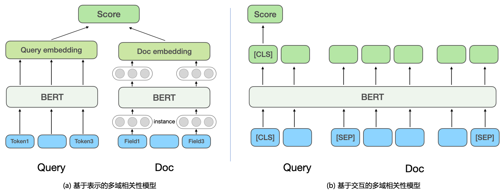

## 大规模分段线性模型（LS-PLM）

早在 2012 年，大规模分段线性模型（Large Scale Piece-wise Linear Model）就是阿里巴巴的主流推荐模型，又被称为混合逻辑回归（Mixed Logistics Regression），可以看作在逻辑回归的基础上采用分而治之的思路，先对样本进行分片，再在样本分片中应用逻辑回归进行 CTR（Click Through Rate，点击率）预估。

## Embedding 技术

Embedding，中文译为「嵌入」，常被翻译为「向量化」或者「向量映射」。形式上讲，Embedding 就是用一个低维稠密的向量「表示」一个对象，可以是词、商品、电影。

## 搜索相关性

搜索相关性旨在计算 Query 和返回 Doc 之间的相关程度，也就是判断 Doc 中的内容是否满足用户 Query 的需求，对应 NLP 中的语义匹配任务（Semantic Maching）。

早期文本匹配：仅仅考虑 Query 与 Doc 的字面匹配程度，通过 TF-IDF、BM25 等基于 Term 的匹配特性来计算相关性。

- 优点：线上计算效率高
- 缺点：（1）基于 Term 的关键词匹配泛化性能较差，缺少语义和词序信息；（2）无法处理一词多义或多词一义的问题，漏匹配和误匹配现象严重。

传统语义匹配模型：主要包括（1）隐式空间的匹配：将 Query 和 Doc 都映射到同一个空间的向量，再用向量距离或相似度作为匹配分，如 Partial Least Square (PLS)；（2）基于翻译模型的匹配：将 Doc 映射到 Query 空间后进行匹配或计算 Doc 翻译成 Query 的概率。

深度语义匹配模型：实现方法上分为基于表示（Representation-based）和基于交互（Interaction-based）的方法。

**基于表示的深度语义匹配模型**：分别学习 Query 和 Doc 的语义向量表示，再基于两个向量计算相似度。

- DSSM 模型 [微软]：提出经典的双塔结构的文本匹配模型，分别使用相互独立的两个网络结构构建 Query 和 Doc 的向量表示，用余弦相似度衡量两个向量的相关程度。
- NRM [微软 Bing 搜索]：针对 Doc 表征问题，除了基础的 Doc 标题和内容，还考虑了其他多源信息（每类信息称为一个域 Field），如外链、用户点击过的 Query 等，考虑一个 Doc 中有多个 Field，每个 Field 内又有多个实例（Instance），每个 Instance 对应一个文本，如一个 Query 词。模型首先学习 Instance 向量，将所有 Instance 的表示向量聚合起来就得到一个 Field 的表示向量，将多个 Field 的表示向量聚合起来得到最终 Doc 的向量。
- SentenceBERT：将预训练模型 BERT 引入到双塔的 Query 和 Doc 的编码层，采用不同的 Pooling 方式获取双塔的句向量，通过点乘、拼接等方式对 Query 和 Doc 进行交互。

**基于交互的深度语义匹配模型**：不直接学习 Query 和 Doc 的语义表示向量，而是在底层输入阶段就让 Query 和 Doc 进行交互，建立一些基础的匹配信号，再将基础匹配信号融合成一个匹配分。

- ESIM：是预训练模型引入之前被业界广泛使用的经典模型，首先对 Query 和 Doc 进行编码得到初始向量，再用 Attention 机制进行交互加权后与初始向量进行拼接，最终分类得到相关性得分。引入预训练模型 BERT 进行交互计算时，通常将 Query 和 Doc 拼接作为 BERT 句间关系任务的输入，通过 MLP 网络得到最终的相关性得分。
- CEDR：在 BERT 句间关系任务获得 Query 和 Doc 向量之后，对 Query 和 Doc 向量进行拆分，进一步计算 Query 与 Doc 的余弦相似矩阵。

---

**参考**

[1] 王喆，《深度学习推荐系统》2020