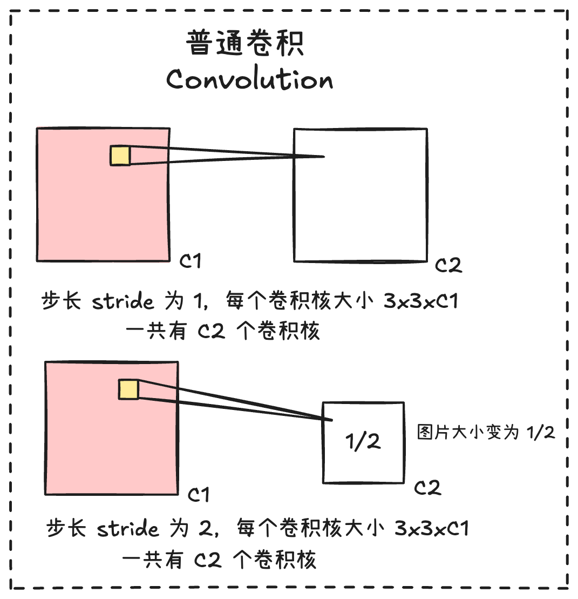
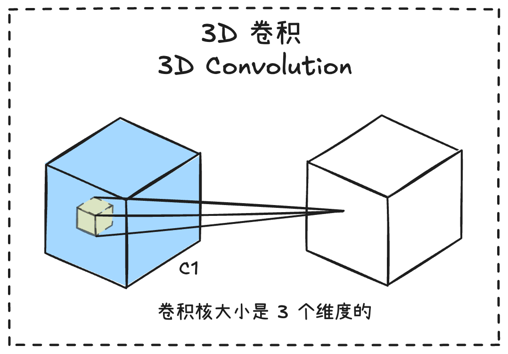
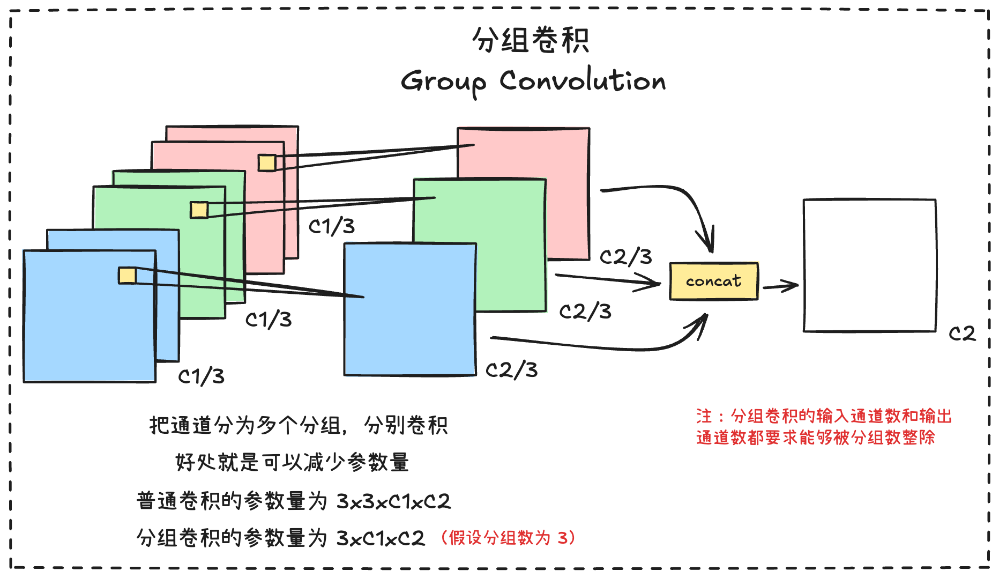
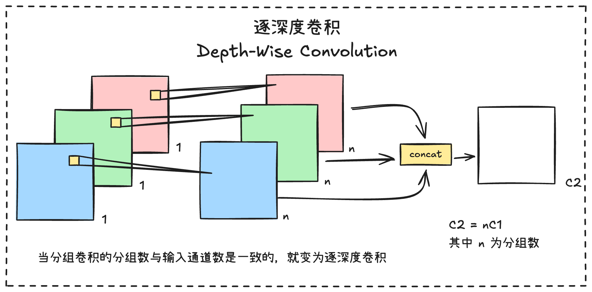
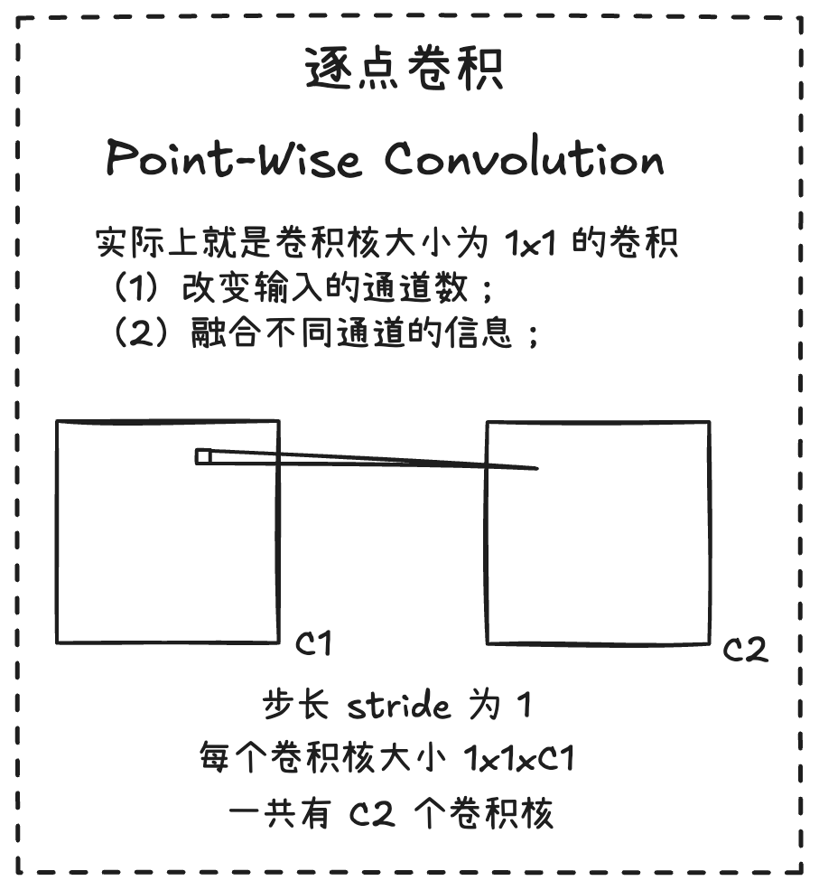
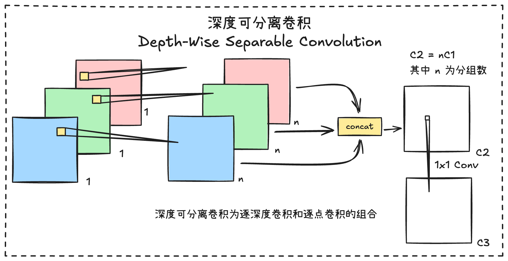
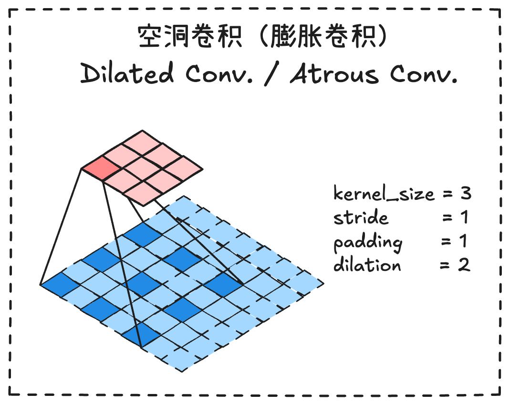
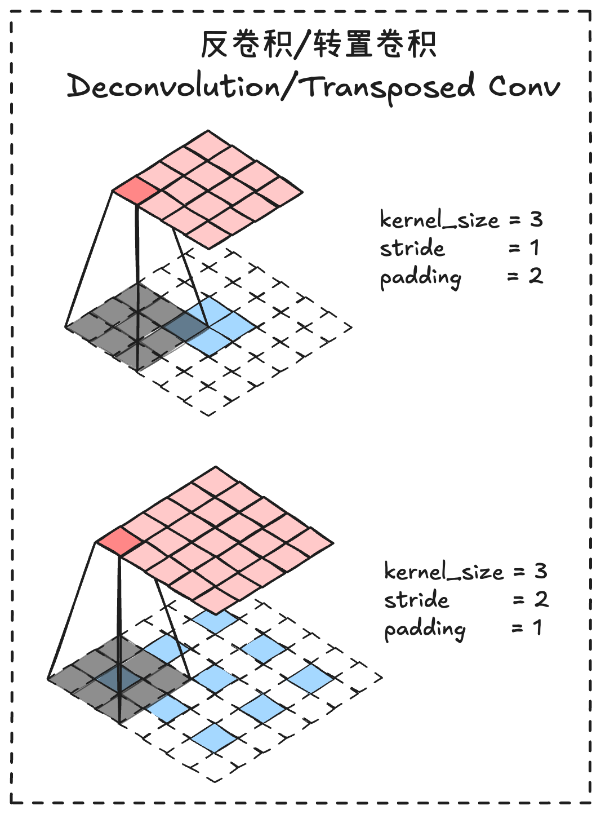
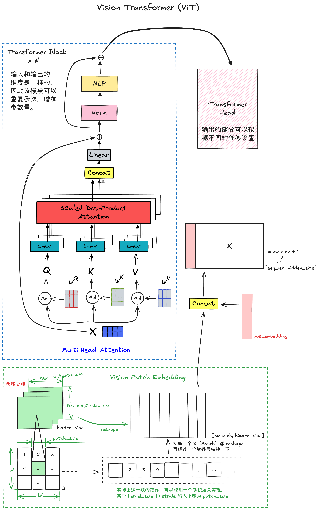
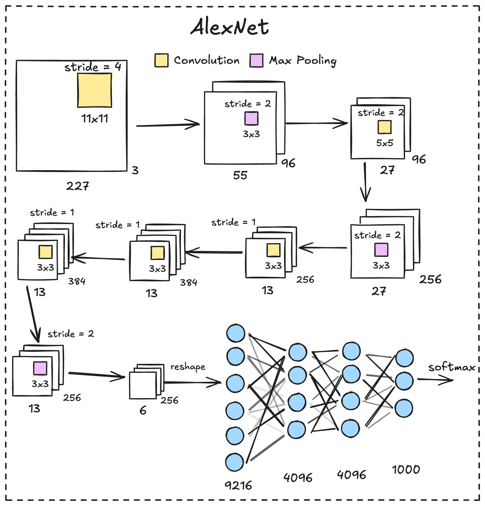

## 各种卷积方式



最基本的卷积，每个卷积核的大小为 `[channel_size, kernel_size, kernel_size]`，通过设定 `sride` 的大小可以缩小特征图的大小。在 PyTorch 上的实现如下：

```python
nn.Conv2d(in_channels=in_channel,    # 输入特征的通道数
          out_channels=out_channel,  # 输出特征的通道数
          kernel_size=kernel_size,   # 卷积核窗口的大小
          stride=stride,             # stride 设置为 1 特征图不变，设置为 2 特征图变为 1/2
          padding=padding)           # 卷积时候在特征图外部补充零的大小

```















## 卷积组块（Block）

### Inception

2014 年由 Google 在论文中提出

### 残差结构

残差结构（Residual）由何恺明等人于 2015 年在微软研究院（Microft Research）在论文 [Deep Residual Learning for Image Recognition](https://arxiv.org/abs/1512.03385) - CVPR 2016 上提出，在 ImageNet 图像分类竞赛（ILSVRC 2015）上获得冠军，证明了超深网络（例如 ResNet-152）的训练是有可能实现的。

残差结构引入残差块和跳跃🔗（Skip Connection）让梯度可以直接反向传播，如果使用数学表达为：

$y=F(x)+x$

其中 $x$ 是输入，$F(x)$ 是卷积层提取的特征。

### 倒残差结构

倒残差结构（Inverted Residual）在 MobileNetV2 的论文中首次提出。

## 网络结构

### ViT（Vision Transformer）



#### 基本原理

ViT 与 Transformer 的唯一区别就在于，ViT 多了一个将图片进行嵌入的操作，简单地将就是把图片想个办法转换成 Transformer 的输入形式。实现这一个部分的操作就是 Vision Patch Embedding。

Vision Patch Embedding 把图片均匀分成一个一个的 Patch，然后把每一个 Patch reshape 成一维，这样就可以进入一个线性层，最后把所有 Patch 经过线性层之后的输出，与 `pos_embedding` 拼接成一个矩阵，作为 Transformer Block 的输入。看懂了 Patch Embedding 就懂 ViT 了。

Vision Patch  Embedding 的实现，其实就是一个卷积操作，其中 `kernel_size` 和 `stride` 都为 `patch_size`，完整的结构可以看上图。

#### 代码实现

```python
import torch
from torch import nn


class TransformerHead(nn.Module):
    def __init__(self, hidden_dim):
        super().__init__()
        self.ln = nn.LayerNorm(hidden_dim)

    def forward(self, x):
        x = self.ln(x)
        return x


class TransformerBlock(nn.Module):
    def __init__(self, num_heads, hidden_dim, mlp_dim, dropout, attention_dropout):
        super().__init__()
        self.num_heads = num_heads

        self.ln_1 = nn.LayerNorm(hidden_dim)
        self.self_attention = nn.MultiheadAttention(hidden_dim, num_heads, dropout=attention_dropout, batch_first=True)
        self.dropout = nn.Dropout(dropout)

        self.ln_2 = nn.LayerNorm(hidden_dim)
        self.mlp = nn.Sequential(
            nn.Linear(hidden_dim, mlp_dim),
            nn.GELU(),
            nn.Dropout(dropout),
            nn.Linear(mlp_dim, hidden_dim),
            nn.Dropout(dropout),
        )

    def forward(self, input):
        x = self.ln_1(input)
        x, _ = self.self_attention(x, x, x, need_weights=False)
        x = self.dropout(x)
        x = x + input

        y = self.ln_1(x)
        y = self.mlp(y)
        return x + y


class VisionPatchEmbedded(nn.Module):
    def __init__(self, image_size, hidden_dim, patch_size, dropout):
        super().__init__()
        self.image_size = image_size
        self.patch_size = patch_size
        self.hidden_dim = hidden_dim
        self.conv_proj = nn.Conv2d(in_channels=3, out_channels=hidden_dim, kernel_size=patch_size, stride=patch_size)
        self.class_token = nn.Parameter(torch.zeros(1, 1, hidden_dim))
        self.seq_length = (image_size // patch_size) ** 2 + 1
        self.pos_embedding = nn.Parameter(torch.empty(1, self.seq_length, self.hidden_dim).normal_(std=0.02))
        self.dropout = nn.Dropout(dropout)

    def forward(self, x):
        batch_size, _, h, w = x.shape
        n_h = h // self.patch_size
        n_w = w // self.patch_size
        x = self.conv_proj(x)
        x = x.reshape(batch_size, self.hidden_dim, n_h * n_w)
        x = x.permute(0, 2, 1)

        batch_class_token = self.class_token.expand(batch_size, -1, -1)
        x = torch.cat([batch_class_token, x], dim=1)
        x = x + self.pos_embedding
        x = self.dropout(x)
        return x


class VisionTransformer(nn.Module):
    def __init__(self, image_size, patch_size, num_layers, num_heads, hidden_dim, mlp_dim, attention_dropout, dropout):
        super().__init__()
        self.patch_embedded = VisionPatchEmbedded(image_size, hidden_dim, patch_size, dropout)
        self.transformer_layers = nn.Sequential(
            *[TransformerBlock(num_heads, hidden_dim, mlp_dim, dropout, attention_dropout) for _ in range(num_layers)])
        self.head = TransformerHead(hidden_dim)

    def forward(self, x):
        x = self.patch_embedded(x)
        x = self.transformer_layers(x)
        x = self.head(x)
        return x


if __name__ == '__main__':
    image = torch.randn((1, 3, 224, 224))
    _, _, height, width = image.shape
    image_size = height
    model = VisionTransformer(image_size, patch_size=16, num_layers=12, num_heads=12, hidden_dim=768, mlp_dim=3072,
                              attention_dropout=0.5, dropout=0.5)
    output = model(image)
    print(output.shape)

```

## 经典网络

### AlexNet


