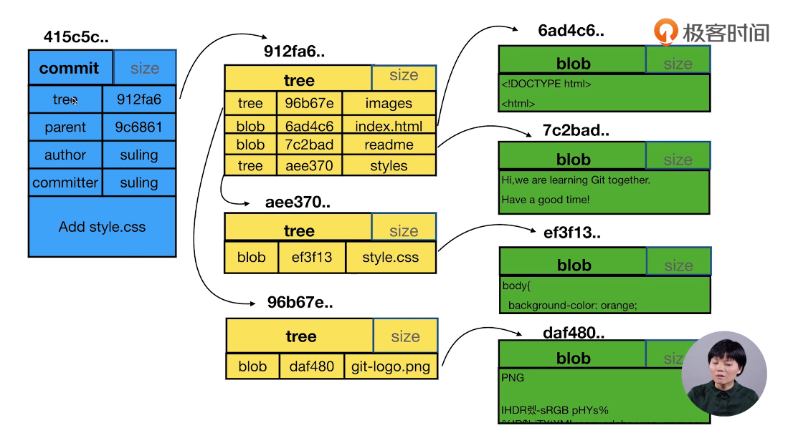
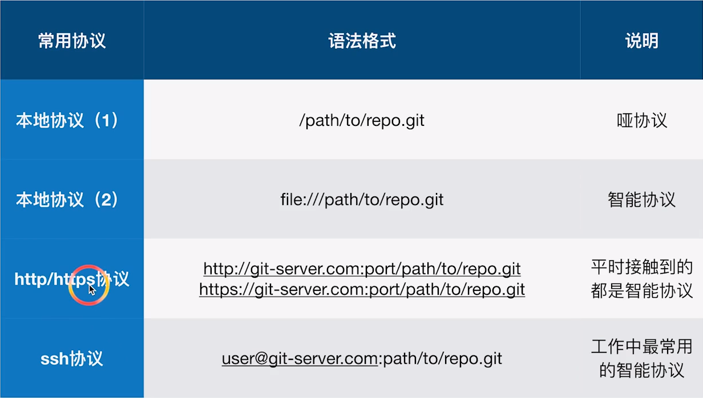

## 第一章 Git 基础

### 1. 基本操作

#### 1.1. 配置 user 信息

配置自己的用户名为 `strongnine`，邮箱为 `strongnine@163.com`，实际用的时候请将此换成自己的用户名和邮箱。

```shell
$ git config --global user.name 'strongnine'
$ git config --global user.email 'strongnine@163.com'
```

#### 1.2. config 的三个作用域

```shell
$ git config --global
$ git config --local
```

可以显示自己目前的局部（local）或者全局（global）的配置。

```shell
# 显示 config 设置
$ git config --list --local
$ git config --list --global
```

#### 1.3. git 命令

创建仓库可以在 GitHub 上创建仓库，然后再通过 `git clone` 克隆到自己的本地，也可以现在本地新建的文件夹里用 `git init` 初始化创建仓库。

```shell
# git 仓库的初始化
$ git init
```

**查看当前仓库状态**：`git status` 可以查看当前仓库的状态。能够看到文件的修改、删除、添加、以及重命名（重命名的逻辑就是删除一个文件并且添加一个文件），并且还能够看到当前存在的冲突啥的。

**添加文件**：`git add` 可以将某个文件的更新添加到暂存区区里；

>`git add -u`：将文件的修改、文件的删除，添加到暂存区。
>
>`git add .`：将文件的修改，文件的新建，添加到暂存区。
>
>`git add -A`：将文件的修改，文件的删除，文件的新建，添加到暂存区。
>
>`git add -A` 相对于 `git add -u` 命令的优点 ： `git add -A` 可以提交所有被删除、被替换、被修改和新增的文件到数据暂存区，而 `git add -u` 只能操作跟踪过的文件。`git add -A` 等同于 `git add -all`. 

**提交修改**：`git commit` 将当前暂存区里的更新提交，会用默认编辑器跳出信息，可以在第一行添加提交的备注信息，例如 "add README.md". 

> `git commit -m"add README.md"` 可以直接将备注信息一起提交。

**查看日志**：`git log` 可以查看提交记录；

> `git log --graph` 可以有比较图形化的界面。

**删除文件**：`git mv <文件名>` 是正确删除文件的方法。

**重命名的文件**：`git mv oldname newname`

> 当你重命名了一个文件之后，用 `git status` 会提示有一个文件被删除，有一个文件是新的 Untracked 文件。

**重置文件**：`git reset --hard` 用来对暂存区的文件进行重置。

!!! warning
    注意：`git reset` 是一条相对危险的命令。

### 2. 版本管理

#### 2.1. 查看历史

```shell
# git log 不带参数的时候是整个完整的日记
# 如果加上 --oneline，就只显示每次提交的备注
$ git log --oneline

# 还可以指定最近的几个 commit，以 4 为例：
$ git log -n4 --oneline

# 查看本地有多少分支和创建分支
$ git branch -v
$ git checkout -b temp 415c5c...

# git log 只显示当前分支的日志，--all 查看全部分支
$ git log --all
# 还可以图形化显示
$ git log --all --graph

# 通过图形界面查看版本历史：
# 命令行输入 gitk 会弹出图形界面
$ gitk
```

网友「夕夕熊」补充：

> 加上 --decorate 参数，部分同学才可以显示（master）（temp）等分支信息。

#### 2.2. .git 目录的内容

cat 命令主要用来查看文件内容，创建文件，文件合并，追加文件内容等功能。
cat HEAD 查看 HEAD 文件的内容
git cat-file 命令 显示版本库对象的内容、类型及大小信息。
git cat-file -t b44dd71d62a5a8ed3 显示版本库对象的类型
git cat-file -s b44dd71d62a5a8ed3 显示版本库对象的大小
git cat-file -p b44dd71d62a5a8ed3 显示版本库对象的内容

HEAD：指向当前的工作路径
config：存放本地仓库（local）相关的配置信息。
refs/heads：存放分支
refs/tags：存放tag，又叫里程牌 （当这次 commit 是具有里程碑意义的，比如项目 1.0 的时候 就可以打 tag）
objects：存放对象 .git/objects/ 文件夹中的子文件夹都是以哈希值的前两位字符命名 每个 object 由 40 位字符组成，前两位字符用来当文件夹，后 38 位做文件。

 **commit、tree、blob 的关系**



一个 commit 对应一颗 tree，tree 相当于文件夹，blob 相当于具体的文件（数据）。git 里面，文件内容相同， 就是视为同一个文件。


当创建了新的空文件夹时，使用 `status` 不会检测到这个空的文件夹。

#### 2.3. 分离头指针

变更没有基于某个 branch，在分离头指针进行的 commit，如果没有及时合并到某个 branch，可能会被 git 当作垃圾清掉。如果这种变更是重要的，就要将其与某个 branch 绑在一起。

`git checkout -b` 可以创建新分支并且切换到该新的分支。

HEAD 指针可以指向某个分支的最后一次提交，也可以不和某个分支挂钩，当处于分离头指针时，可以直接指向某个 commit。它只能够定位到某个 commit。

`git diff [commit1] [commit2]` 可以比较两个具体的 commit 的差异。`git diff HEAD HEAD^1` 将当前结点与其父亲结点进行对比。`HEAD^1, HEAD~1, HEAD~, HEAD^` 都一样。

> 1、一个节点，可以包含多个子节点（checkout 出多个分支）
> 2、一个节点可以有多个父节点（多个分支合并）
> 3、\^是 \~ 都是父节点，区别是跟随数字时候，\^2 是第二个父节点，而 \~2 是父节点的父节点
> 4、\^ 和 \~ 可以组合使用,例如 HEAD\~2\^2

## 第二章 独自使用 Git

### 1. 删除无用分支

```shell
# 查看所有分支
$ git branch -av
# 删除分支
$ git branch -d 分支名
# 如果分支还未被 merged 用强制删除
# 要注意保证分支无用
$ git branch -D 分支名
```

### 2. commit 的操作

#### 2.1. 修改 commit 的 message

```shell
# 修改最新 commit 的信息
$ git commit --amend
# 想要修改旧 commit 的信息，需要先选择其父节点
# 运行后会弹出一个交互界面，在里面修改、保存之后
# 还会继续弹出一个交互界面，提示要把 message 如何修改
$ git rebase -i 父节点
```

这种操作只适用于还未合并到「主线」 的分支上，否则会影响到合作者的工作。

#### 2.2. 整理多个 commit 

```shell
# 和上一个操作相似
# 在弹出的交互界面进行不同的修改就行（会有提示）
$ git rebase -i 父节点

# 上面的是把「连续的」commit 合并，还有一种是把「间隔的」合并
$ git rebase -i 父节点
```

#### 2.3. 对比差异

```shell
# 对比暂存区和 HEAD 里面内容的差异（看看做了哪些改动）
$ git diff --cached

# 对比工作区和暂存区的不同
$ git diff

# 只比较某个文件
$ git diff -- <文件名>

# 查看不同提交的指定文件的差异
$ git diff <指针 1> <指针 2> -- <文件名>
```

#### 2.4. 恢复变更

```shell
# 把暂存区里面的文件全部恢复成和 HEAD 一样的
$ git reset HEAD

# 让工作区的文件恢复为暂存区一样（变更工作区）
$ git checkout -- index.html

# 取消暂存区部分文件的更改
$ git reset HEAD -- <文件名>...
```

#### 2.5. 消除最近几次提交

```shell
# 将头指针指向特定的某次提交，并且删除这之前的提交
# <危险指令> 慎用！！！
$ git reset --hard <指针>
```

#### 2.6. 删除文件

```shell
# 正确删除文件的方法
$ git rm <文件名>
```

#### 2.7. 临时加塞的紧急任务 —— stash 的使用

```shell
# 把当前状态存放
$ git stash
# 列出状态区
$ git stash list
# 恢复暂存区（弹出之前放进 stash 顶的），但是 stash 堆栈里的信息还会在
$ git stash apply
# 恢复的基础上还会丢掉 stash 里面的信息
$ git stash pop
```

### 3. Git 管理

#### 3.1. 指定不需要 Git 管理的文件

`.gitignore` 文件上的内容就是表示指定类型的文件不给 Git 进行管理。

#### 3.2. Git 的备份

 

哑协议传输进度不可看见，智能协议可见。智能协议比哑协议快。

```shell
# --bare 代表不带工作区的裸仓库
# 哑协议
$ git clone --bare /path/to/repo.git <拷贝路径.git>
# 智能协议
$ git clone --bare / file:///path/to/repo.git <拷贝路径.git>

# 把本地的变更同步到远端
$ git remote -v
$ git remote add <名称> <协议地址>
# 查看分支
$ git branch -av
$ git push <名称>
$ git push --set-upstream <  > <  >
```

## 第三章 Github 同步

### **配置公私钥**

在 Github 首页上，寻找 help，在上面有关于如何 `connecting to github with SSH` 的做法。

```bash
# 打开 git bash 在里面输入下面命令
# 若干存在 id_rsa 和 id_rsa.pub 文件则代表已经有公私钥
# 否则应该要根据 Help 上的提示进行生成
$ ls - al ~/.ssh
# 查看 id_rsa.pub 的内容
$ cd ~/.ssh
$ cat id_rsa.pub
# 复制里面的内容，前往 github 账户设置里面添加 SSH keys
```

### **把本地仓库同步到 Github**

```bash
# 添加一个新的 remote
$ git remote add <名称> <SSH>
# 查看已有的 remote
$ git remote -v

# 把所有内容 push
$ git push <name> --all
# 如果远端有某些文件是本地未包含的，这个分支会被拒绝 push
# 需要把远端的先「拉」下来
$ git fetch <name> master
# 切换到 master 分支
$ git checkout master
# 与远端的 .../master 的分支合并
$ git merge <远端分支>
# 但注意如果两个分支都是独立的，没有共同的历史，那么会拒绝合并
# 查看 merge 帮助
$ git merge -h
$ git merge --allow-unrelated-histories <远端分支>
# 现在进行 push 就不会报错了
$ git push <name> master
```

**注：在之后为了方便学习，将一些命令与视频里面的进行同步，`<name>` 会用 github 来代替，因为我们把远端的仓库 fetch 下来并且命名为 gitHub 了**

> 个人笔记总结
>
> - `git remote -v` 查看远程版本库信息
>
> - `git remote add <name> <url> `添加 githup 远程版本库
>
> - `git fetch <name>` 拉取远程版本库
>
> - `git merge -h` 查看合并帮助信息
>
> - `git merge --allow-unrelated-histories githup/master` 合并 `<name>` 上的 master 分支（两分支不是父子关系，所以合并需要添加 --allow-unrelated-histories）
> - `git push <name>` 推送同步到 `<name>` 仓库
>
> —— by DriveMan_邱佳源

> fast forward 到底是什么？
>
> 举个例子，本地分支往远端分支做 push，如果远端分支不是本地分支的祖先，那它俩就不是 fast forward 了。反之，它俩就是 fast forward 的关系。

## 第四章 Git 多人单分支集成协作

### 1. 多个人对文件修改

#### 1.1. 不同人修改了不同文件

```bash
# 
# 会出现 Non fast_forwards 的报错，远端仓库会拒绝这个 push
# 先把远端的 fetch 下来
$ git fetch <name>(github)
# 然后查看 branch 会发现有 [ahead 1, behind 1] 这样的信息，
# 代表远端有的这里没有和这里有的远端没有
$ git branch -av
feature/add_git_commands     07c85df [ahead 1, behind 1] ......

# 有时候会考虑合并
$ git merge (github/feature/add_git_commands)
```

> 老师你好，我有个问题哈，clone 命令 git clone git@github.com:git2019/git_learning.git 既然已经把远程仓库所有内容都克隆到本地了，为什么还需要 git checkout -b feature/add_git_commands origin/feature/add_git_command 命令基于远程分支在本地建立分支，不是从远程clone下来了嘛，为什么还要新建，难道 clone 命令不能克隆分支吗？
>
> 作者回复：我们在本地无法直接在 clone 下来的远程分支上做变更的，只能基于远程分支建本地分支后，才能创建 commit。

#### 1.2. 不同人修改同一文件的不同区域

```bash
# pull 会把远端的内容拉下来，并且本地的也会进行更新
# 简介的方法就是直接 pull，还有一种是 fetch + merge
# 多查看 branch ，看看 ahead 和 behind 的数目
$ git branch -av

# 当只有 ahead 没有 behind 的时候，肯定是 fast-forward 可以提交
```

> fast-forword 看了英语翻译为快进，结合 git branch -av 中的 ahead 和 behind，ahead 是本地仓库比远端仓库多 commit，behind 是本地仓库比远端仓库少 commit。对正常的备份系统来说，我本地只能比备份多，备份不可能比我本地多才是。然而，git 由于多用户提交原因出现备份比本地多了，本地滞后了，所以需要 pull 一下，让本地比备份相等或多，这种情况就是 fast forward ，也就是我本地要比备份快进。不知理解对否？
>
> 作者回复：其实就是两个分支的关系为 0|n 或者 n|0 ，如果两个分支直接为 n|m 的关系就不是 fast forward 。A 分支比 B 分支多 5 个 commit，B 比 A 分支多 3 个 commit。A 和 B 就不是 fast forward。

#### 1.3. 不同人修改同一文件的同一区域

```bash
# 如果 push 不上去，使用 merge 又提示已经更新到最新了
# 就说明远端变了，要及时更新
$ git pull
Auto-merging (index.html)
CONFLICT(content): Merge conflict in (index.html)
# 提示 CONFLICT(content) 说明文件有冲突，不能自动合并 index.html
# 打开这个文件，会提示哪里出现冲突
$ vi index.html
# 编辑完成后查看状态
$ git status

# 如果这个分支有问题了，可以用 --abort 退出合并
$ git merge --abort
$ git commit -am'(commit text)'
```

### 2. 更改了文件名

#### 2.1. 同时变更了文件名和内容

```bash
# 其中有一个人变更了文件名
# 另一个人只变更了文件内容
# pull 的话会智能识别问题
$ git pull
```

#### 2.2. 同一文件改成不同的文件名

```bash
# 依旧是报冲突
$ git pull
# 查看工作目录，会出现未命名的文件，和两个重命名的文件
# 如果使用 diff 查看两个文件的差异，不会显示差异
$ diff <file-1> <file-2>
# 使用 status，会提示：
both deleted:  <oldfilename>
added by us:   <filename-1>
added by them: <filename-2>
# 可以先移除不要的文件，再加上想要保存的文件名
$ git rm <filename-2>
$ git add <filename-1>
$ git commit -am'(commit text)'
```

## 第五章 集成使用禁忌

### 1. 禁止向集成分支执行 push -f

`-f, --force` 是强制更新，即使不是 fast-forward 也可以 push。

```bash
# 把历史 reset 到某个 log
$ git reset --hard (b3f390c)
# 强制 push，就会把在 b3f390c 后面做的改变都删除
$ git push -f (origin) (feature/add_git_commands)
```

### 2. 禁止向集成分支执行变更历史的操作

## 第六章 GitHub

### 1. 核心功能

代码预览、项目管理、集成、团队管理、社交编码（开源）、文档、存放代码。

### 2. 寻找开源项目

 使用高级搜索：光标放在搜索框里，按回车就会出现 advanced search 了。

可以在 Help 上查看有哪些高级搜索的语法。  

### 3. 搭建个人博客

通过高级搜索在搜索框中输入 `blog easily start in:readme stars:>5000` 找到 jekyll-now 仓库。

第一步就是 fork 一个到自己的账号里去。fork 完后修改工程名称：`<username>.github.io`

第二步修改 `_config.yml`。

在 `_posts` 里面新增文件格式为：`2018-12-24-<title>.md`

 

## 第七章 团队协作

### 1. 创建团队项目

### 3. 挑选合适的分支集成策略

在仓库的 Insights => Network 里可以看到特性分支演变历史。

在 Options 的 Merge button 可以设置允许哪种合并。

1. merge 把分支最后合并到 master 上去；
2. squash merging 把分支的所有 commits 变成一个，再放到主线上去。（在当前主线后面加上）
3. rebase merging 把分支的所有 commits 添加到主线后面去。

后面两种适合于线性开发的情况。

### 4. issue 跟踪

issue 上有标签管理，对不同的问题进行分类。

还可以对 issue 进行模型管理，自定义一些问题报告的模板。

有 Bug report、Feature request 等。

**使用 Projects 的看板来管理 issue**

点击 Pojects 进行看板（Board）的设置。

### 5. Code review

在 Settings 的 Branches 上可以设置特殊分支的保护规则。比如对于 master 分支进行 push 保护，每次 push 都要有特定人数去检查才能通过。

### 6. 多分支的集成

特性分支往主干合，要发 Pull requests。

`git rerere` 是一个隐藏功能，允许你让 Git 记住解决一个块冲突的方法，在下一次看到相同冲突时，自动解决。

## 第八章 GitLab

这两章先看视频过一遍，等到应用的时候可以复习。目前不知道具体的使用需求，先大概看个印象。

## 其它问题

### 1. 在 Windows 上如何支持中文

参考[解决 Git 在 windows 下中文乱码的问题.md](https://gist.github.com/nightire/5069597)。

> 有一个注意的点：目前无法解决输入中文字符会显示乱码的问题
>
> 解决方案：
>
> 1. `git commit` 时，不用 `-m` 参数，直接回车让 vim 来处理
> 2. 进 vim 后按 `i` 进入编辑模式，完成后再保存退出

